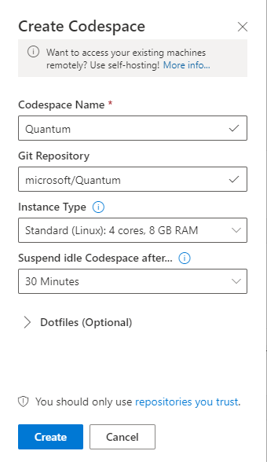

# Microsoft Quantum Development Kit Samples

 [](https://mybinder.org/v2/gh/Microsoft/Quantum/⭐binder)

These samples demonstrate the use of the Quantum Development Kit for a variety of different quantum computing tasks.

Each sample is self-contained in a folder, and demonstrates how to use Q# to develop quantum applications.

A small number of the samples have additional installation requirements beyond those for the rest of the Quantum Development Kit.
These are noted in the README.md files for each sample, along with complete installation instructions.

## Getting started

You can find instructions on how to install the Quantum Development Kit in [our online documentation](https://docs.microsoft.com/quantum/install-guide/), which also includes
an introduction to [quantum programming concepts](https://docs.microsoft.com/en-us/quantum/concepts/).

For a quick guide on how to set up a development environment from scratch using [Visual Studio Code](https://code.visualstudio.com) or [Visual Studio Codespaces](https://online.visualstudio.com/login), see [here](#setting-up-your-development-environment).

A [Docker](https://docs.docker.com/install/) image definition is also provided for your convenience, see [here](#running-a-jupyter-notebook-with-docker) for instructions on how to build and use it.

### First samples

If you're new to quantum or to the Quantum Development Kit, we recommend starting with the [Getting Started samples](./samples/getting-started/).

After setting up your development environment using one of the options above, try to browse to `samples/getting-started/teleportation` via the terminal and run `dotnet run`. You should see something like the following:
```
Round 1: Sent False, got False.
Teleportation successful!
Round 2: Sent True, got True.
Teleportation successful!
Round 3: Sent False, got False.
Teleportation successful!
Round 4: Sent False, got False.
Teleportation successful!
Round 5: Sent False, got False.
Teleportation successful!
Round 6: Sent False, got False.
Teleportation successful!
Round 7: Sent True, got True.
Teleportation successful!
Round 8: Sent False, got False.
Teleportation successful!
```

Congratulations, you can now start quantum programming!

## Going further

As you go further with quantum development, we provide several different categories of samples for you to explore:

- **[Algorithms](./samples/algorithms)**:
  These samples demonstrate various quantum algorithms, such as database search and integer factorization.
- **[Arithmetic](./samples/arithmetic)**:
  These samples show how to coherently transform arithmetic data.
- **[Characterization](./samples/characterization)**:
  These samples demonstrate how to learn properties of quantum systems from classical data.
- **[Chemistry](./samples/chemistry)**:
- **[Diagnostics](./samples/diagnostics)**:
  These samples show how to diagnose and test Q# applications.
- **[Error Correction](./samples/error-correction)**:
  These samples show how to work with quantum error correcting codes in Q# programs.
- **[Interoperability](./samples/interoperability)**:
  These samples show how to use Q# with different host languages.
- **[Numerics](./samples/numerics)**:
  The samples in this folder show how to use the numerics library.
- **[Runtime](./samples/runtime)**:
  These samples show how to work with the Q# simulation runtime.
- **[Simulation](./samples/simulation)**:
  These samples show how to simulate evolution under different Hamiltonians.

We also encourage taking a look at the [unit tests](./samples/tests) used to check the correctness of the Quantum Development Kit samples.

## Setting up your development environment

This repo contains several configuration files that will make it easy to get started with coding. Below we lay out some instructions for getting started with [VSCode](#visual-studio-code) or [Visual Studio Codespaces](#visual-studio-codespaces). The latter will use the Docker image that has all dependencies pre-installed for you using the configuration file in the `.devcontainer` directory. If you prefer working with Jupyter notebooks, we also provide instructions for how to set that up [below](#running-a-jupyter-notebook-with-docker).

### Visual Studio Codespaces

For minimal set-up time, we recommend using [Visual Studio Codespaces](https://online.visualstudio.com/login) in the browser. To get started, perform the following steps:

1. Create an Azure account [here](https://azure.microsoft.com/en-us/free/), if you don't already have one. You'll have to set up payment information - note that you get $200 of free credit and you won't be charged unless you upgrade.
2. Create a Codespaces environment. Please follow the quickstart guide [here](https://docs.microsoft.com/visualstudio/online/quickstarts/browser).
When creating the Codespace, make sure to enter `microsoft/Quantum` in the "Git Repository" field, see below screenshot.



When you click "Create", a new Codespace instance is created with a development environment based on the Docker container that is defined in this repo's Dockerfile. Recommended extensions are also automatically installed for you.

3. Done! You can now start developing using Q# in your browser. Open a terminal to start running your first samples (see [here](#first-samples)).

### Visual Studio Code

If you prefer to develop code locally, we recommend to install an editor such as [Visual Studio Code](https://code.visualstudio.com/download). Make sure to install the [.NET Core SDK 3.1 or later](https://www.microsoft.com/net/download) on your local machine. For more detailed instructions on how to set up VS Code for development with the QDK, go to our docs [here](https://docs.microsoft.com/en-us/quantum/quickstarts/install-command-line?tabs=tabid-vscode).

Once you have installed VS Code and the .NET Core SDK, download this repository to your computer and open the folder in VS Code. The editor will automatically recognize the files in the `.vscode` folder and request you to install the recommended extension. This includes the [Microsoft Quantum Development Kit for Visual Studio Code](https://marketplace.visualstudio.com/items?itemName=quantum.quantum-devkit-vscode) extension, which is the fastest way to get started with the QDK.

Open a terminal to start running your first samples (see [here](#first-samples)).

### Running a Jupyter Notebook with Docker

Another way to quickly start developing in Q# is to use Docker and launch a Jupyter notebook on your local machine. You can use the included [Dockerfile](./Dockerfile) to create a docker image with all the necessary libraries to use the Quantum Development Kit to build quantum applications in C#, Python or Jupyter.

Once you have installed [Docker](https://docs.docker.com/install/), you can
use the following commands to get you started:

To build the docker image and tag it `iqsharp`:
```sh
docker build -t iqsharp .
```

To run the image in the container named `iqsharp-container` with interactive command-line and 
redirect container port 8888 to local port 8888 (needed to run jupyter):
```sh
docker run -it --name iqsharp-container -p 8888:8888 iqsharp /bin/bash
```

From the corresponding container command line, you can run the C# version of the Teleportation sample using: 
```sh
cd ~/samples/getting-started/teleportation && dotnet run
```

Similarly, you can run the Python version of the Teleportation sample using: 
```sh
cd ~/samples/getting-started/teleportation && python host.py
```

Finally, to start jupyter notebook within the image for the Teleportation sample, use:
```sh
cd ~/samples/getting-started/teleportation && jupyter notebook --ip=0.0.0.0 --no-browser 
```

Once Jupyter has started, you can open in your browser the Teleportation notebook (you
will need a token generated by jupyter when it started on the previous step):

> http://localhost:8888/notebooks/Notebook.ipynb

Once you're done, to remove container named `iqsharp-container`:
```sh
docker rm --force iqsharp-container
```
