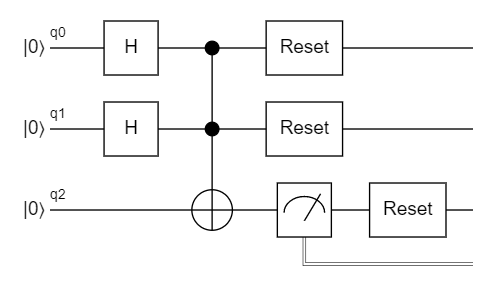

# Visualization of Q# Programs

This sample demonstrates the use of the [`%trace` magic command](https://docs.microsoft.com/qsharp/api/iqsharp-magic/trace) in IQ# to visualize your Q# program within a Jupyter notebook.



## Running the Sample

To run this sample, you will need Jupyter Notebook and the IQ# kernel.
For instructions on how to set up these tools see the [getting started guide](https://docs.microsoft.com/quantum/install-guide/).
To start the Jupyter Notebook use the following command in this directory.

```
PS> jupyter notebook TraceExample.ipynb
```

Use the `Run` button to walk through the notebook line by line. 

## Manifest

- [TraceExample.ipynb](./TraceExample.ipynb): Jupyter Notebook with Q# code demonstrating how to use the `%trace` command.
