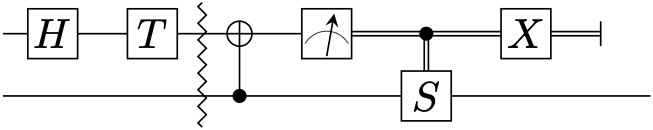

# Generating quantum circuit diagrams from execution traces

This sample illustrates how `IQuantumProcessor` can be used to generate quantum
circuit diagrams from Q# program execution traces, using the [⟨q|pic⟩
language](https://github.com/qpic/qpic).  It makes uses of custom intrinsic
operations and classical control transformations.

## Prerequisites

- The Microsoft [Quantum Development Kit](https://docs.microsoft.com/azure/quantum/install-overview-qdk/)
- [⟨q|pic⟩](https://github.com/qpic/qpic)

## Running the Sample

This sample can be run in a number of different ways, depending on your
preferred environment.

### C# in Visual Studio Code or the Command Line

At a terminal, run the following command (with example arguments for the inputs) in the `host` directory:

```dotnetcli
dotnet test
```

After running the tests, the directory `bin/Debug/net6.0` contains ⟨q|pic⟩
circuit diagrams for the test cases.  You can create picture files from them
using the following commands (assuming that ⟨q|pic⟩ is installed):

```shell
cp bin/Debug/net6.0/t-injection.qpic .
qpic -f png t-injection.qpic
```

The resulting file will look as follows:



### C# in Visual Studio 2019

Open the folder containing this sample in Visual Studio ("Open a local folder"
from the Getting Started screen or "File → Open → Folder..." from the menu bar)
and set `host/host.csproj` as the startup project. Press Start in
Visual Studio to run the sample.

## Manifest

- [host/Program.qs](host/Program.qs): Q# code implementing test cases, each generating a quantum circuit diagram.
- [host/host.csproj](host/host.csproj): Q# test project for the sample.
- [simulator/Processor.cs](simulator/Processor.cs): C# implementation of the `QuantumProcessorBase` abstract class.
- [simulator/Simulator.cs](simulator/Simulator.cs): C# implementation of the `QuantumProcessorDispatcher` abstract class for custom simulators.
- [simulator/Library.qs](simulator/Library.qs): Q# custom intrinsic operations used with this simulator.
- [simulator/Simulator.Barrier.cs](simulator/Simulator.Barrier.cs): Simulator specific implementation of intrinsic `Barrier` operation.
- [simulator/Simulator.SavePicture.cs](simulator/Simulator.SavePicture.cs): Simulator specific implementation of intrinsic `SavePicture` operation.
- [simulator/simulator.csproj](simulator/simulator.csproj): C# library project for the simulator.
