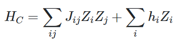
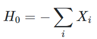

# Quantum Approximate Optimization Algorithm

This is an example of a Quantum Approximate Optimization Algorithm (QAOA) implemented in a Q# program. QAOA was first introduced by Farhi et al. in [A Quantum Approximate Optimization Algorithm](https://arxiv.org/abs/1411.4028).

This sample is based on the "Traveling Santa" problem described by Stephen Jordan in his Quantum Algorithm Zoo post, [Traveling Santa Problem](http://quantumalgorithmzoo.org/traveling_santa/).

## Prerequisites

- The Microsoft [Quantum Development Kit](https://docs.microsoft.com/azure/quantum/install-overview-qdk/).

## Description

Here we will use a combinatorial optimization problem to demonstrate the usage of an implementation of QAOA. We consider a "Traveling Santa" problem. Santa needs to visit a a few different houses and end up back on the North Pole. We can express this as a graph with 4 nodes, where each node represents a house and each node is connected to all other nodes. The edges in the graph each have a cost associated with them. The goal is to find the optimal route such that Santa visits all houses only once and ends up back on the North Pole.

The idea behind QAOA is to express a problem as an Ising Hamiltonian and replace each variable z_j with a Pauli-Z operation acting on the jth qubit, such that



If we then find the ground state of said Hamiltonian, we can find the solution by measuring the value of each qubit in the Pauli-Z basis. To find said ground state we intersperse time evolutions of the instance Hamiltonian by time evolutions induced by a "driver" Hamiltonian that evolves the qubits by a Pauli-X rotation of the form:



In this sample, the time evolutions are pre-determined, however, these could also be found variationally as part of a hybrid classical-quantum algorithm, by using e.g. gradient descent.

In this sample, we use QAOA to solve the Traveling Santa problem. The constraints are expressed as penalties in the instance Hamiltonian weights and coupling terms. For a more detailed explanation of this sample, please visit Stephen Jordan's Quantum Algorithm Zoo post, [Traveling Santa Problem](http://quantumalgorithmzoo.org/traveling_santa/).

## Running the Sample

Browse to the `samples/algorithms/qaoa` folder and run `dotnet build` to build the project. Then run `dotnet run [options] --no-build`. Optionally, omit the `--no-build` option to automatically build the project before execution.

To see options, run `dotnet run -- --help`.

```bash
Options:
  --num-trials <num-trials> (REQUIRED)    The number of trials to run.
  -s, --simulator <simulator>             The name of the simulator to use.
  --version                               Show version information
  -?, -h, --help                          Show help and usage information
```

## Manifest

- **qaoa/**
  - [QAOA.csproj](./QAOA.csproj): Main Q# project for the example.
  - [QAOA.qs](./QAOA.qs): The Q# implementation of the QAOA program.

## Example run

```bash
> dotnet run --num-trials 20
result = [True,False,True,False,True,True], cost = 23.46, satisfactory = True
result = [True,False,True,False,True,True], cost = 23.46, satisfactory = True
result = [True,False,True,False,True,True], cost = 23.46, satisfactory = True
result = [True,False,True,False,True,True], cost = 23.46, satisfactory = True
result = [True,False,True,False,True,True], cost = 23.46, satisfactory = True
result = [True,False,True,False,True,True], cost = 23.46, satisfactory = True
result = [True,False,True,False,True,True], cost = 23.46, satisfactory = True
result = [True,False,True,False,True,True], cost = 23.46, satisfactory = True
result = [True,False,True,False,True,True], cost = 23.46, satisfactory = True
result = [True,False,True,False,True,True], cost = 23.46, satisfactory = True
result = [True,False,True,False,True,True], cost = 23.46, satisfactory = True
result = [True,False,True,False,True,True], cost = 23.46, satisfactory = True
result = [True,False,True,False,True,True], cost = 23.46, satisfactory = True
result = [True,False,True,False,True,True], cost = 23.46, satisfactory = True
result = [True,False,True,False,True,True], cost = 23.46, satisfactory = True
result = [True,False,True,True,True,True], cost = 29.16, satisfactory = False
result = [True,False,True,True,True,True], cost = 29.16, satisfactory = False
result = [True,False,True,False,True,True], cost = 23.46, satisfactory = True
result = [True,False,True,False,False,False], cost = 13.73, satisfactory = False
result = [True,False,True,False,True,True], cost = 23.46, satisfactory = True
result = [True,False,True,False,False,False], cost = 13.73, satisfactory = False
Simulation is complete

Best itinerary found: [True,False,True,False,True,True], cost = 23.46
85% of runs found the best itinerary
```
